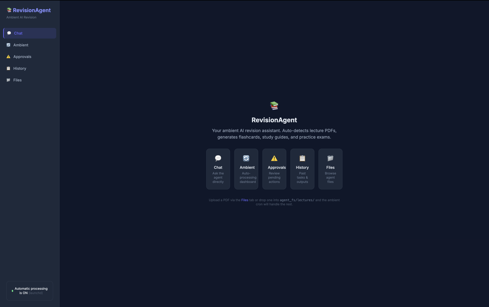
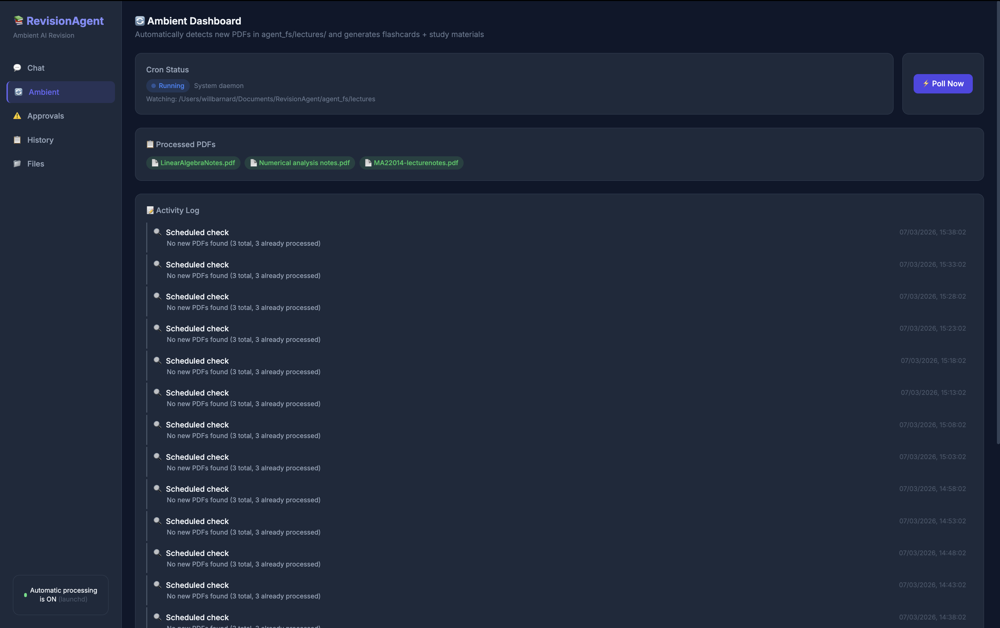
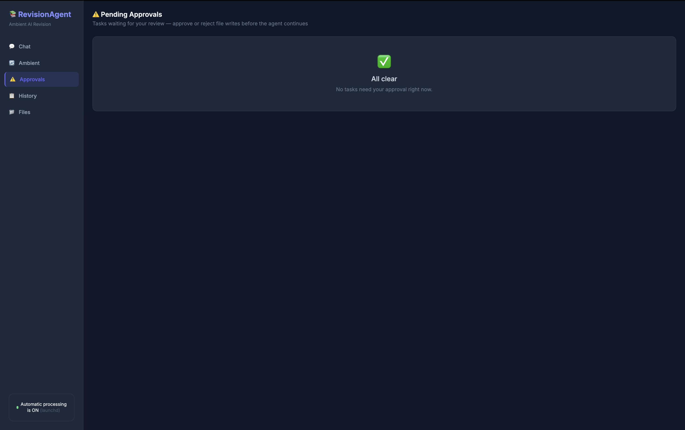
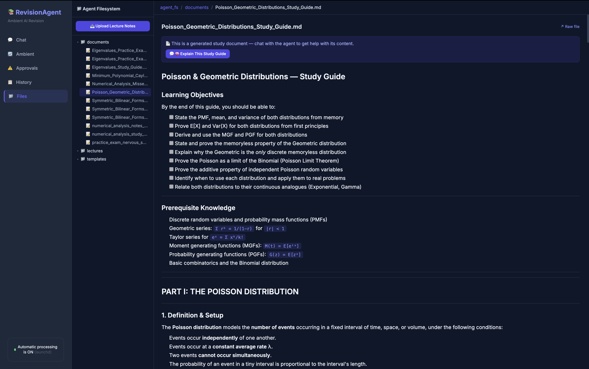
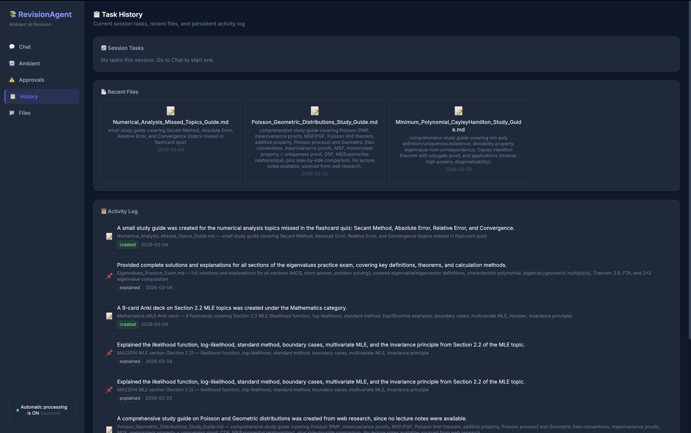
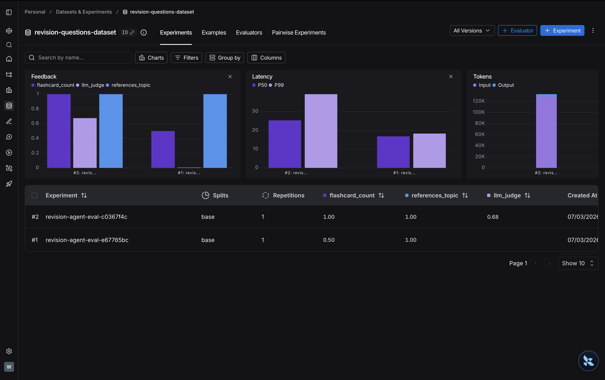
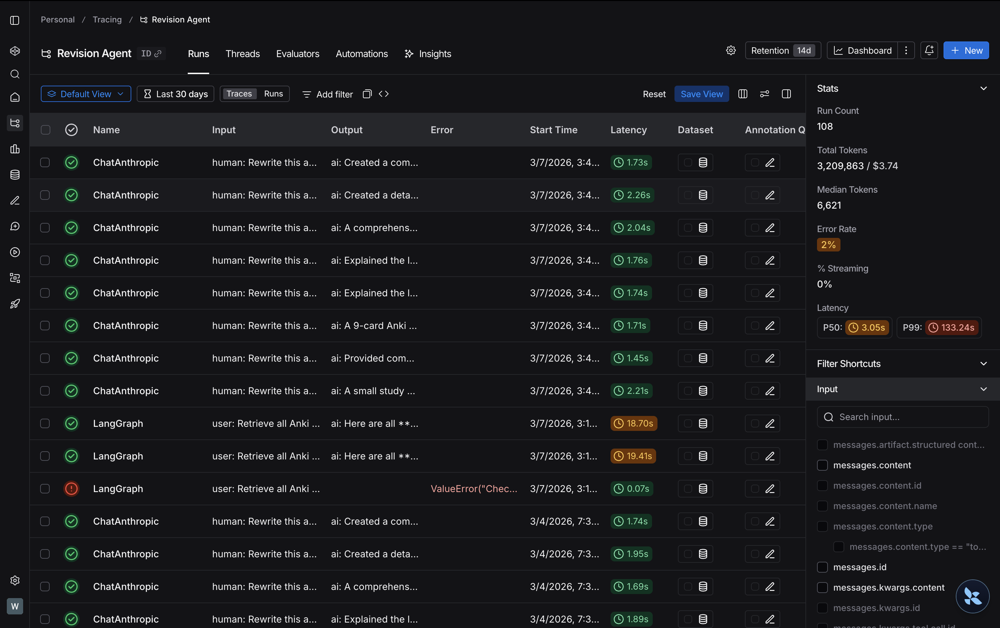

# RevisionAgent

An end-to-end **agentic AI learning platform** built from scratch — PDF ingestion, RAG retrieval, autonomous study material generation, Anki flashcard sync, and a streaming web UI.

---

## Architecture

```
Browser (HTMX + Tailwind + KaTeX)
  └── FastAPI — async REST + WebSocket task streaming
        ├── Task lifecycle manager (pending → running → complete/interrupted)
        ├── Human-in-the-loop approval interrupt system
        └── LangGraph Deep Agent (Claude Sonnet)
              ├── Tool middleware: per-run call limits on retrieval + web search
              ├── Tools: RAG retrieval, PDF ingestion, web search, memory R/W
              └── MCP client ──► custom Anki MCP server ──► AnkiConnect

Knowledge layer: ChromaDB (per-topic collections) + OpenAI text-embedding-3-small
Background: Ambient polling loop — watches lecture dir, auto-ingests, generates docs
Eval: LangSmith experiments + hybrid deterministic/LLM-as-judge evaluator suite
```

---

## Technical depth

**Async task orchestration** — every agent run is a managed async task with a WebSocket channel for real-time status streaming. The server tracks task state, handles mid-run interrupts, and resumes cleanly after human approval.

**RAG pipeline** — PDFs are chunked (1000 tokens, 200 overlap), embedded with OpenAI, and stored in per-topic Chroma collections. Retrieval is collection-aware: the agent resolves which collections are relevant before querying, avoiding cross-topic noise.

**Guardrailed autonomy** — a custom `ToolCallLimitMiddleware` enforces hard caps on retrieval and web search calls per run and per thread, preventing unbounded fan-out in long conversations.

**Human-in-the-loop interrupts** — sensitive write operations (file writes, Anki deck creation) trigger a mid-run interrupt via LangGraph's checkpoint mechanism. Execution is suspended, the pending action is surfaced to the user in the Approvals UI, and the agent resumes only after an explicit approve or reject — without losing any in-flight state.

**Custom MCP server** — rather than calling AnkiConnect directly, the agent communicates through a purpose-built MCP server (`anki_mcp_server.py`) that exposes a clean tool interface. This keeps the agent decoupled from the external API and makes the integration swappable.

**Ambient background mode** — a polling loop (`ambient.py`) watches the lectures directory, auto-ingests new PDFs into Chroma, runs agent workflows to produce study materials, and writes a structured manifest. Fully autonomous, no user prompt needed.

**Evaluation pipeline** — a curated LangSmith dataset covers representative tasks and deliberate edge cases, including a "gap case" where no Anki deck exists. The evaluator suite layers fast deterministic checks (structural output, topic keyword match) with an LLM-as-judge scoring relevance, completeness and clarity. The design explicitly distinguishes agent bugs from data gaps — a gap-case low score points to missing knowledge, not a broken agent.

**Memory system** — the agent maintains structured memory sections (profile, collections, preferences, activity log) with lock-protected atomic writes. Activity entries are normalised to UTC and summarised into plain-English logs surfaced in the UI.

---

## Stack

| | |
|---|---|
| LLM | Anthropic Claude Sonnet |
| Agent framework | LangGraph DeepAgents |
| Vector store | ChromaDB + OpenAI `text-embedding-3-small` |
| Web search | Tavily |
| External integration | MCP (custom server) + AnkiConnect |
| Backend | FastAPI, WebSockets, async Python 3.11+ |
| Evaluation | LangSmith + hybrid evaluator suite |
| Frontend | HTMX, Tailwind, KaTeX |

---

## Quick start

```bash
pip install -r requirements.txt
# Set ANTHROPIC_API_KEY, OPENAI_API_KEY, TAVILY_API_KEY, LANGSMITH_API_KEY in .env
uvicorn server:app --host 0.0.0.0 --port 8080
```

Run evals:
```bash
cd Evals && python run_eval.py
```

---

## Screenshots

<table>
  <tr>
    <td><br/><sub>Chat interface</sub></td>
    <td><br/><sub>Ambient dashboard — cron status, processed PDFs, activity log</sub></td>
  </tr>
  <tr>
    <td><br/><sub>Human-in-the-loop approval queue</sub></td>
    <td><br/><sub>Agent-generated study guide with KaTeX-rendered math</sub></td>
  </tr>
  <tr>
    <td><br/><sub>Task history + persistent activity log</sub></td>
    <td><br/><sub>LangSmith trace view — 108 runs, P50 3s, 2% error rate</sub></td>
  </tr>
  <tr>
    <td><br/><sub>LangSmith eval experiments — feedback, latency, token metrics across runs</sub></td>
  </tr>
</table>